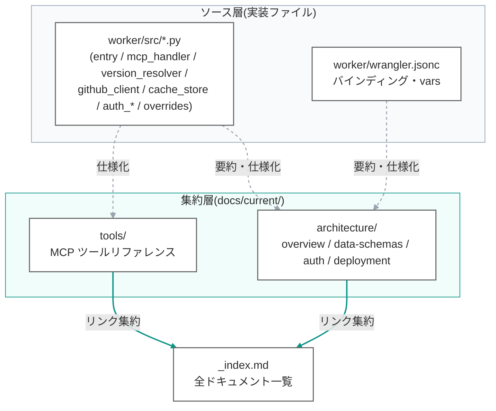

# docs/current/ — 最新仕様書 整理方針

> 最終更新: 2026-07-02
> ステータス: 整備完了

---

## 1. 目的

`docs/current/` は**今動いている仕様だけを集約するディレクトリ**。設計調査・変更履歴・コスト試算などの経緯は `development/`(gitignore)に残し、「現行の仕様を知りたい」ときの参照先を本ディレクトリに整備する。

| ディレクトリ | 目的 | git |
|---|---|---|
| `docs/current/`(本ディレクトリ) | **最新仕様のみ**。経緯は書かない | コミットする |
| `development/docs/` | 設計ドキュメント(初期設計・調査) | gitignore |
| `development/changelog/` | 更新ログ | gitignore |

---

## 2. ドキュメント配置の全体方針

ソース(実装ファイル)を single source of truth とし、`docs/current/` はその概要・図表・設計意図を明文化する **2 層構造**。



**原則: ソース層が正**。集約層は行間の設計意図(解決アルゴリズム・スキーマ・認証フロー)を明文化する。

---

## 3. ディレクトリ構成

```
docs/current/
  README.md              ← この方針文書
  _index.md              ← 全ドキュメントへのリンク集
  architecture/
    overview.md          ← 全体構成・設計原則・コンポーネント
    data-schemas.md      ← R2 キー・manifest・pin・auth_context・KV
    auth.md              ← BYO PAT / OAuth 2.1 の認証フロー
    deployment.md        ← リソース・secrets・デプロイ手順
  tools/
    reference.md         ← 6 MCP ツールの仕様・ワークフロー
```

---

## 4. 運用ルール

1. **`docs/current/` に置くのは「今動いている仕様」だけ**。経緯・調査・試算は `development/` に残す。
2. **機能を変える PR に仕様書の更新を含める**。`worker/src/` を変えたら該当ドキュメントを同一コミットで更新する。
3. **`_index.md` は全ドキュメントへのリンクを持つ**。追加したら必ずリンクを追記する。
4. **mermaid はリポジトリ共通のカラースキーム**([.claude/mermaid-theme.md](../../.claude/mermaid-theme.md))に従い、書いたらレンダリング検証する(`linkStyle` 番号ずれ防止)。

---

## 5. 整備ステータス

| 分類 | ドキュメント | ステータス |
|---|---|---|
| architecture | overview | 完了 |
| architecture | data-schemas | 完了 |
| architecture | auth | 完了 |
| architecture | deployment | 完了 |
| tools | reference | 完了 |
