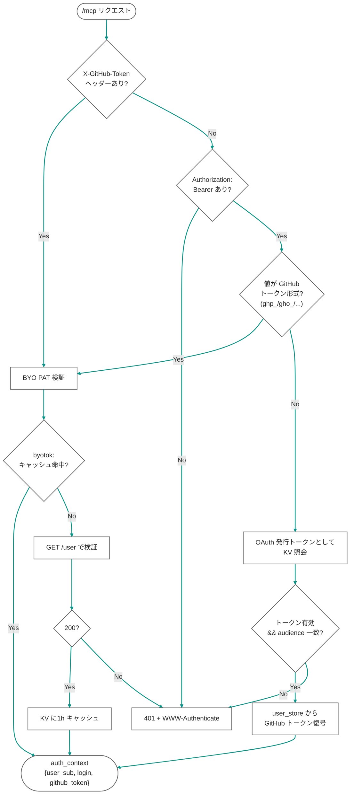

# 認証(BYO PAT / OAuth 2.1)

> 最終更新: 2026-07-02

`/mcp` は本番(`ENVIRONMENT=production`)では未認証リクエストに **401 + WWW-Authenticate** を返す。認証は2方式あり、どちらも最終的に「そのユーザーの GitHub トークン」を得て、それで GitHub API を叩く(BYO=各自の権限・レート)。

---

## 1. 方式の比較

| | **BYO PAT(主経路)** | OAuth 2.1(任意) |
|---|---|---|
| 運営の初期設定 | 不要(secret ゼロ) | GitHub OAuth App 登録 + `GITHUB_OAUTH_CLIENT_ID` / `_SECRET` |
| ユーザーの操作 | MCP 設定にトークンを1行 | 初回にブラウザで GitHub ログイン(自動) |
| トークン供給 | `X-GitHub-Token` または `Authorization: Bearer <github-token>` | サーバー発行の Bearer → 保存済み GitHub トークン |
| 状態 | 実装・稼働中 | 実装済み(secret 未投入のため無効) |

いずれも **各ユーザー自身の GitHub トークン**を使う点は同じ。

---

## 2. 認証解決フロー(`auth_resolver.resolve_auth_context`)



- `_looks_like_github_token`: 接頭辞 `ghp_` / `gho_` / `ghu_` / `ghs_` / `ghr_` / `github_pat_` を BYO PAT と判定
- BYO PAT は `GET /user` で一度だけ本人確認し、`byotok:{sha256(token)[:20]}` → `{user_sub, login}` を KV に 1 時間キャッシュ(毎回の検証を回避)。**トークン自体は保存しない**

---

## 3. BYO PAT の使い方(クライアント設定)

GitHub トークンを発行([github.com/settings/tokens](https://github.com/settings/tokens))。**public のみならスコープ不要**、private も見るなら classic は `repo`(または fine-grained で対象 repo に Contents: Read-only)。

**Claude Code**(user スコープ推奨・非コミット):
```bash
claude mcp add --transport http --scope user open-context \
  https://open-context.gospelo.dev/mcp \
  --header "X-GitHub-Token: ghp_..."
```

**Codex**(`~/.codex/config.toml`、要 `experimental_use_rmcp_client`):
```toml
[mcp_servers.open-context]
url = "https://open-context.gospelo.dev/mcp"
bearer_token_env_var = "OPEN_CONTEXT_GH_TOKEN"   # export に GitHub トークン
```

> トークンを含む `.mcp.json` はコミットしないこと(本リポジトリでは `.gitignore` 済み)。

---

## 4. OAuth 2.1(任意経路)

有効化するには GitHub OAuth App を登録し secret を投入する:

- callback: `https://open-context.gospelo.dev/auth/callback`
- `wrangler secret put GITHUB_OAUTH_CLIENT_ID` / `GITHUB_OAUTH_CLIENT_SECRET` / `SESSION_ENCRYPTION_KEY`

二層構成:

1. **MCP クライアント ↔ 本サーバー**: `.well-known/oauth-*` + `/oauth/register|authorize|token`(PKCE S256)。本サーバーが独自 Bearer を発行
2. **本サーバー ↔ GitHub**: `/oauth/authorize` でセッション未確立なら `/auth/login` → GitHub → `/auth/callback` でトークン取得 → AES-GCM 暗号化して `user:{user_sub}` に保存

未設定時は `/auth/*` が「OAuth not configured」を返す(BYO PAT には影響しない)。

---

## 5. 開発時のバイパス

`ENVIRONMENT=development`(ローカル `pywrangler dev`、`.dev.vars` で設定)のときのみ、`X-Debug-Github-Token` ヘッダー(または無トークン)で認証ゲートを短絡できる。**本番では無効**。

---

## 関連

- スキーマ(KV キー・auth_context): [data-schemas.md](data-schemas.md)
- デプロイ・secrets: [deployment.md](deployment.md)
