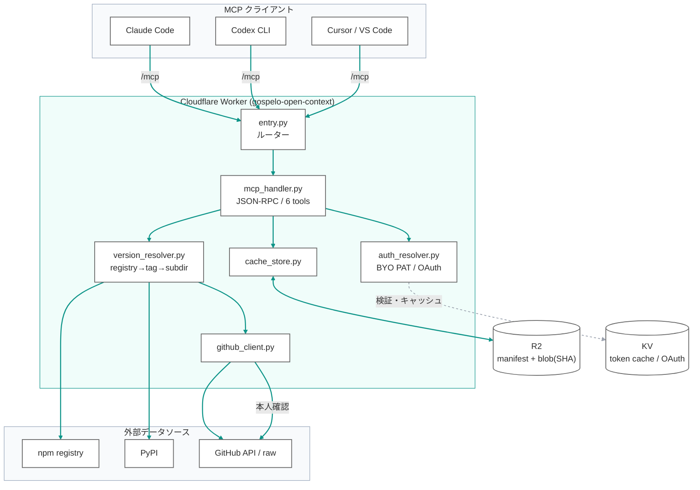

# 全体構成・設計原則

> 最終更新: 2026-07-02

---

## 1. TL;DR

gospelo-open-context は、**バージョン厳密なパッケージのドキュメント/ソースコード**をコーディングエージェントへ供給するリモート MCP サーバーである。rtfmbro に着想を得た **Context7 の代替**で、`git clone` + ローカル FS を前提とする方式とは異なり、**GitHub API + R2 コンテンツアドレスキャッシュ**で Cloudflare Python Workers 上にネイティブ実装している。

- エンドポイント: `https://open-context.gospelo.dev/mcp`(MCP Streamable HTTP)
- 6 ツール: `list_contexts` / `get_readme` / `get_documentation_tree` / `read_files` / `grep_repo` / `get_outline`
- エコシステム: **npm + PyPI**
- 認証: **BYO PAT**(各ユーザー自身の GitHub トークン)を主経路、GitHub OAuth 2.1 を任意経路

核心は **「バージョンはクライアントが渡す / サーバーはファイルシステムを持たない」**:

- クライアント(エージェント)が実インストール版を読み、`package / version / ecosystem` を明示的に渡す
- サーバーは registry → GitHub の tag を解決し、その版のファイルを GitHub API 経由で取得、R2 に blob SHA でキャッシュ

---

## 2. 設計原則

| # | 原則 | 内容 |
|---|------|------|
| P1 | **バージョン厳密** | クライアントが渡す実インストール版の git tag を解決。学習データや「最新版」ではなく、その版の docs/コードを返す |
| P2 | **docs だけでなくコードも** | `read_files` は docs 限定ではなく `.ts/.d.ts/.py/.pyi/examples/tests` も返す。正確なシグネチャ・実使用例を提供 |
| P3 | **コンテンツアドレスキャッシュ** | R2 blob を git blob SHA でキー化。バージョン間で未変更ファイルは自動デデュープ |
| P4 | **BYO トークン** | 各ユーザーの GitHub トークンで API を叩く。レート制限がユーザーごと 5,000 req/h に分散、private も本人権限で |
| P5 | **サーバーは FS を持たない** | `git clone` せず GitHub API/raw で必要ファイルのみ取得。Workers の制約(FS/子プロセスなし)に適合 |
| P6 | **依存ゼロ** | Pyodide stdlib + `js.fetch` のみ。外部 Python パッケージ非依存(コールドスタート・移植性) |

---

## 3. 全体構成

---

## 4. コンポーネント構成

### 4.1 転送・エントリ層

| モジュール | 役割 |
|---|---|
| `entry.py` | `WorkerEntrypoint.fetch` — パスでルーティング(`/`, `/health`, `/mcp`, `/auth/*`, `/oauth/*`, `/.well-known/*`) |
| `mcp_handler.py` | MCP Streamable HTTP(initialize / tools/list / tools/call / SSE / CORS)+ 6 ツール実装 + 安全上限 |

### 4.2 コアロジック層

| モジュール | 役割 |
|---|---|
| `version_resolver.py` | registry → GitHub repo → tag 照合 → monorepo は package.json で subdir 自動特定。docs override の解決 |
| `github_client.py` | GitHub Trees / Blobs / raw / contents / commits を `js.fetch` で取得(ETag 対応) |
| `cache_store.py` | R2 の manifest / blob / resolve / docs-manifest の read/write |
| `registry_npm.py` / `registry_pypi.py` | 各レジストリから GitHub repo を解決 |
| `chunker.py` | Markdown 見出し / コードシンボルで構造分割(`get_outline`・将来の意味検索の境界) |
| `overrides.py` | docs が別リポジトリにあるライブラリの定義(Python dict) |

### 4.3 認証層

| モジュール | 役割 |
|---|---|
| `auth_resolver.py` | BYO PAT(`X-GitHub-Token` / Bearer)検証、OAuth 発行トークンの解決 |
| `oauth_endpoints.py` / `oauth_store.py` | OAuth 2.1(任意)。.well-known / DCR / authorize / token |
| `auth.py` / `session.py` / `user_store.py` / `encryption.py` | GitHub ログイン・セッション・トークン暗号化保存(OAuth 経路用) |

詳細は [auth.md](auth.md)、[data-schemas.md](data-schemas.md) を参照。

---

## 5. 対応エコシステムと解決

| エコシステム | レジストリ | repo 解決元 | subdir |
|---|---|---|---|
| npm | registry.npmjs.org | `repository.url` / `repository.directory` | monorepo は package.json 照合で自動特定 |
| PyPI | pypi.org/pypi | `project_urls` / `home_page` の GitHub URL | なし(単一パッケージ前提) |

- tag 候補: `v{ver}` / `{ver}` / `{pkg}@{ver}`(npm monorepo)/ `{pkg}-{ver}`(python 流)等を順に照合、全滅時は近傍一致 → default branch
- **docs override**: react / react-dom / astro / typescript は docs が別リポジトリ。詳細は [tools/reference.md](../tools/reference.md#docs-override) と `overrides.py`

---

## 6. デプロイ構成(要約)

- Cloudflare Python Worker(`compatibility_flags: ["python_workers"]`、`cpu_ms: 300000`)
- R2 バケット `open-context-cache`、KV 名前空間 `open-context-AUTH_KV`
- カスタムドメイン `open-context.gospelo.dev`
- `ENVIRONMENT=production`(認証ゲート有効)。ローカル `pywrangler dev` は `.dev.vars` で `development` に上書き

詳細は [deployment.md](deployment.md)。

---

## 7. 関連ドキュメント

| ドキュメント | 内容 |
|---|---|
| [data-schemas.md](data-schemas.md) | R2 キー・manifest・pin・auth_context・KV スキーマ |
| [auth.md](auth.md) | BYO PAT / OAuth 2.1 の認証フロー |
| [deployment.md](deployment.md) | デプロイ・secrets・リソース |
| [tools/reference.md](../tools/reference.md) | 6 MCP ツールの仕様 |
