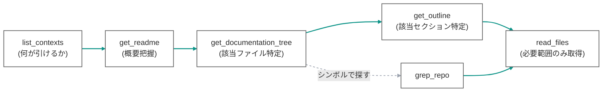

# MCP ツールリファレンス

> 最終更新: 2026-07-02

全ツール共通の必須引数は `package` と `version`、任意で `ecosystem`(`npm`(既定)/ `pypi`)。`version` は**実インストール版**(npm は `node_modules/{pkg}/package.json` の `version`、PyPI は lockfile / dist-info)を渡す — semver レンジではない。

応答末尾には `server: gospelo-open-context v{ver} ({commit})` 行が付く。バージョン解決結果はヘッダー行 `{pkg}@{ver} — {owner}/{repo}[/{subdir}] @ {tag} ({commit7})` として表示され、照合不確実時は `⚠️` 警告が続く。

---

## 1. 標準ワークフロー(docs-first → code)

---

## 2. ツール一覧

### list_contexts
- **引数**: なし
- **返り値**: 対応エコシステム(npm/pypi)+ docs override 済みライブラリ一覧。「override に無くても任意パッケージが使える」旨を明示
- ネットワーク不要(`overrides.py` を読むだけ)

### get_readme(package, version, ecosystem?)
- 指定版の README を GitHub の一致 tag から取得
- subdir に README が無ければ **repo-root の README にフォールバック**
- まず概要を掴むためのエントリポイント

### get_documentation_tree(package, version, ecosystem?, scope?)
- `scope=docs`(既定): ドキュメントファイル(`.md/.mdx/.rst/.txt`)のパス一覧(サイズ付き)
  - docs override があるライブラリは **override repo の docs** を列挙(未バージョンのため警告付き)
  - repo 直下 `docs/` は `/` 接頭辞付きで表示(`read_files` にそのまま渡せる)
- `scope=all`: ソース・型定義・examples・tests を含む全ツリー
- `read_files` の前に該当ファイルを特定するために使う

### read_files(package, version, ecosystem?, requests[])
- `requests`: `[{path, start_line?, end_line?}]`(最大 20)
- **docs 限定ではない**。`.ts/.d.ts/.py/.pyi/examples/tests` も取得可
- `path` は subdir 相対、`/` 接頭辞で repo-root / docs override repo を参照
- 行範囲でスライス(トークン節約)。バイナリ・非 UTF-8 は注記してスキップ

### grep_repo(package, version, ecosystem?, query, ignore_case?, regex?)
- tag 内をキーワード検索し `path:line: 内容` を返す
- `regex=true` で Python 正規表現(ReDoS 対策: クエリ長上限・無効パターンは即エラー)
- `dist/` `compiled/` `.min.` 等の生成物・vendored を除外
- 取得予算・ヒット上限・候補上限を**明示**(サイレント切り捨てなし)。cache 優先で走査し、取得したファイルはキャッシュされ再実行で網羅性が上がる

### get_outline(package, version, ecosystem?, path)
- 単一ファイルの構造(Markdown 見出し / コードのトップレベルシンボル)を**行範囲付き**で返す
- 該当セクションを特定 → `read_files` で該当行だけ取得、という省トークン導線

---

## 3. docs override {#docs-override}

一部ライブラリは**散文ドキュメントが本体リポジトリの外**にある。これらは `overrides.py` で「docs = 別 repo」を定義し、**コードは registry から版厳密に解決したまま、docs だけ別 repo(通常 default branch=未バージョン)**から取得する。`read_files` / `grep_repo` / `get_outline` はコード repo と docs repo を透過的に横断する。

| パッケージ | code(版厳密) | docs(override) |
|---|---|---|
| react / react-dom | facebook/react `packages/react` @ vX | reactjs/react.dev `src/content` @ main |
| astro | withastro/astro `packages/astro` @ astro@X | withastro/docs `src/content/docs` @ main |
| typescript | microsoft/TypeScript @ vX | microsoft/TypeScript-Website `packages/documentation/copy/en` @ v2 |

ライブラリ追加は `overrides.py` に 1 エントリ足すだけ。多くの Python ライブラリは docs をリポジトリ内 `docs/` に持つため override 不要(既存の repo-root docs 機構で拾える)。

---

## 4. エラー・警告の扱い

- 解決失敗(GitHub repo 不明・tag 未一致で default branch 使用・monorepo で版不一致)はツール応答の `isError` または `⚠️` 警告として返す(エージェントが対処できる文言)
- 未認証は JSON-RPC エラー(-32001)+ HTTP 401 + WWW-Authenticate

---

## 関連

- スキーマ: [../architecture/data-schemas.md](../architecture/data-schemas.md)
- 認証: [../architecture/auth.md](../architecture/auth.md)
